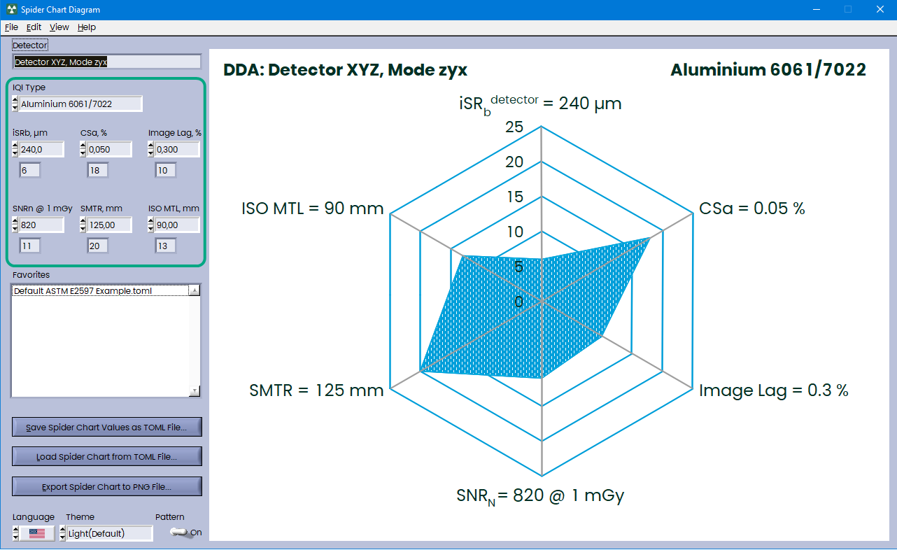

# SpiderChart

An ASTM E2597 spider chart diagram implemented entirely in the Rust programming language



### Build

```bash
cargo build -r
```

### Dependencies

```toml
[dependencies]
hide_console = "0.2"
rfd = "0.15.3" # File Dialogs
rust-ini = "0.21.1"
native-dialog = "0.9.0"
windows = { version = "0.61.3", features = [
    "Win32_Graphics_Gdi", # Font resources
    "Win32_UI_WindowsAndMessaging", # App Style
] }
widestring = "1.0"
serde = { version = "1.0", features = ["derive"] }
toml = "0.8"

[build-dependencies]
bindgen = "0.72.0"
copy_to_output = "2.2"
```

### Requirements

#### [Clang](https://rust-lang.github.io/rust-bindgen/requirements.html#clang)

`bindgen` leverages `libclang` to preprocess, parse, and type check C and C++ header files.

It is required to use Clang 9.0 or greater.

#### Installing Clang on Windows

If you use winget:

```powershell
winget install LLVM.LLVM
```

Alternatively, you can download and install the official pre-built binary from [LLVM download page](http://releases.llvm.org/download.html).

You will also need to set `LIBCLANG_PATH` as an [environment variable](https://www.techjunkie.com/environment-variables-windows-10/) pointing to the `bin` directory of your LLVM install. For example, if you installed LLVM to `D:\programs\LLVM`, then you'd set the value to be `D:\programs\LLVM\bin`.

Alternatively, for MSys2, you can install clang via

```bash
pacman -S  mingw-w64-x86_64-clang
```
#### [LabWindows/CVI](https://www.ni.com/en/support/downloads/software-products/download.labwindows-cvi.html)

To get UI modified you will need to install LabWindows/CVI.