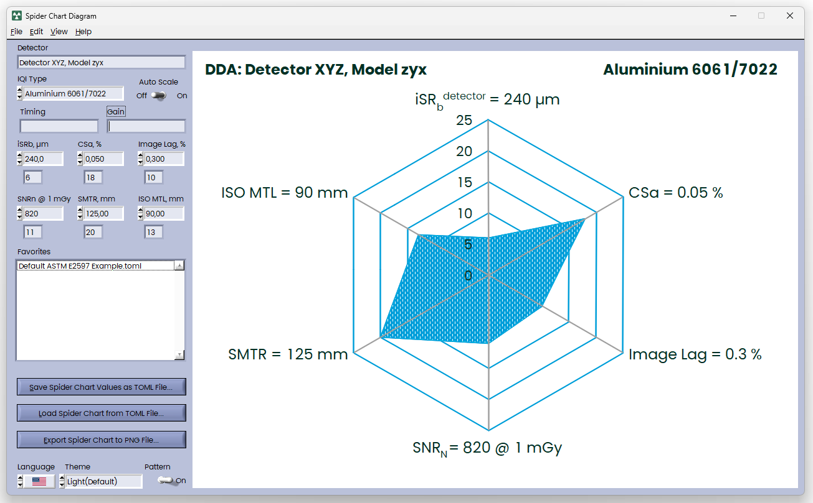

## Spider Chart Diagram

An ASTM E2597 spider chart diagram implemented entirely in the Rust programming language.



## Build

```bash
cargo build -r
```

### Dependencies

```toml
[dependencies]
hide_console = "0.2"
rfd = "0.15.3" # File Dialogs
rust-ini = "0.21.1"
native-dialog = "0.9.0"
windows = { version = "0.61.3", features = [
    "Win32_Graphics_Gdi", # Font resources
    "Win32_UI_WindowsAndMessaging", # App Style
] }
widestring = "1.0"
serde = { version = "1.0", features = ["derive"] }
toml = "0.8"

[build-dependencies]
bindgen = "0.72.0"
copy_to_output = "2.2"
```

## Requirements

### [Clang](https://rust-lang.github.io/rust-bindgen/requirements.html#clang)

`bindgen` leverages `libclang` to preprocess, parse, and type-check C and C++ header files. It is required to build bindings to UI IDs.

Clang 9.0 or greater is required.

####  Installing Clang on Windows

There are two options:

- If you use winget:

```powershell
winget install LLVM.LLVM
```

You will also need to set `LIBCLANG_PATH` as an [environment variable](https://www.techjunkie.com/environment-variables-windows-10/) pointing to the `bin` directory of your LLVM installation. For example, if you installed LLVM to `D:\programs\LLVM`, set the value to `D:\programs\LLVM\bin`.

- Alternatively, for MSys2, you can install clang via:

```bash
pacman -S mingw-w64-x86_64-clang
```

### [LabWindows/CVI](https://www.ni.com/en/support/downloads/software-products/download.labwindows-cvi.html)

To modify the UI, you will need to install LabWindows/CVI.
