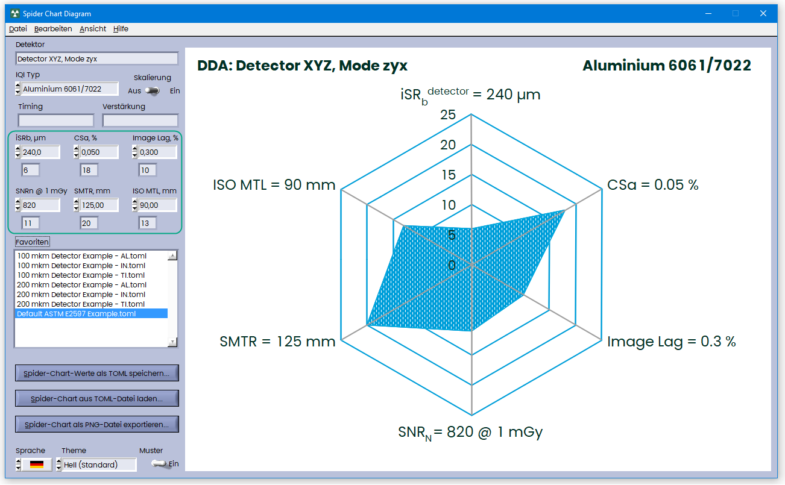
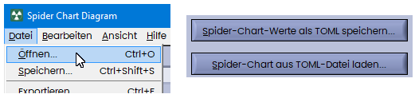
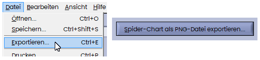
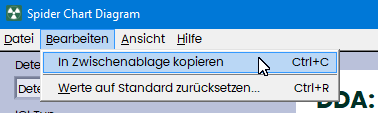
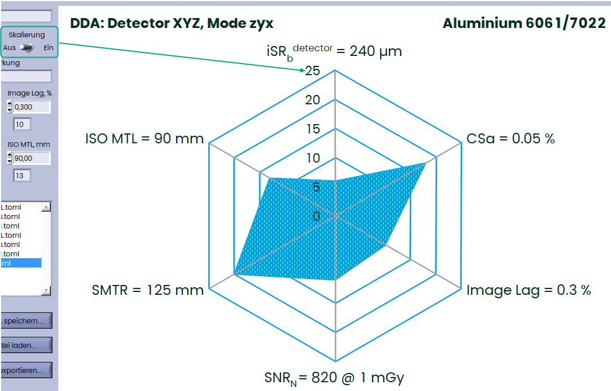
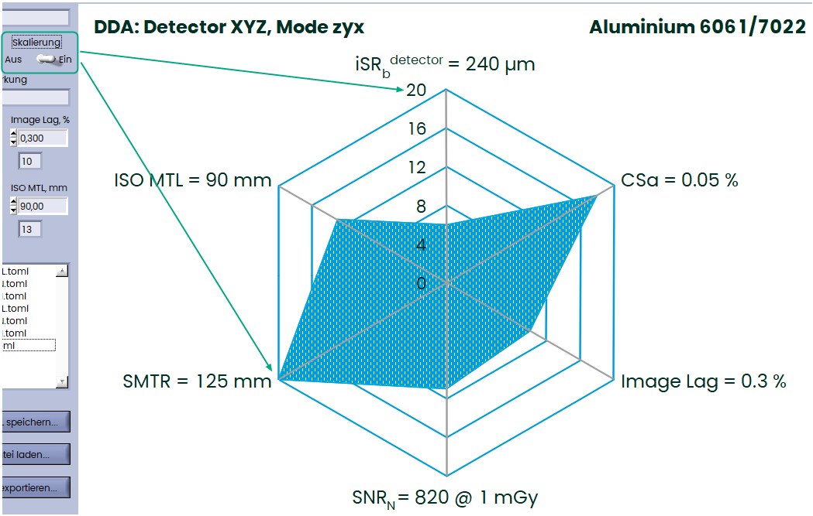
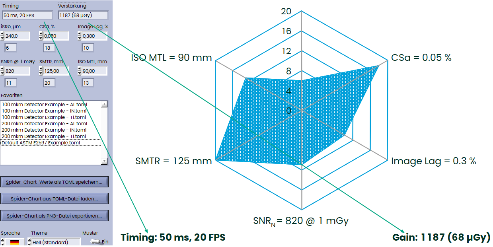
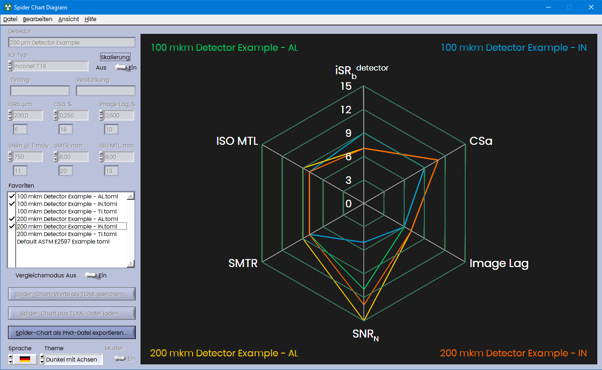
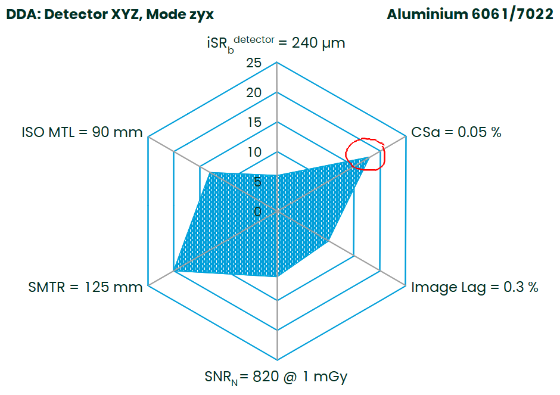

## Spinnennetzdiagramm

Kleines Werkzeug zur Erstellung eines Netz-Zusammenfassungsdiagramms (Spinnennetzdiagramm) gemäß ASTM E2597/E2597M-22:


### Benutzeroberfläche

Einfach die Messwerte von sechs Parametern eingeben – diese werden in Qualitätskennzahlen umgewandelt und als Spinnennetzdiagramm dargestellt (bitte nicht vergessen, den IQI-Typ auszuwählen):



### Diagramme speichern und laden

Sie können Ihre Daten in TOML-Dateien speichern (**TOML** steht für **„Tom's Obvious, Minimal Language.“**) TOML wird häufig in Projekten verwendet, die in Sprachen wie Rust geschrieben sind. Es ist ähnlich wie JSON, YAML oder INI-Dateien und leicht lesbar:

```toml
iqi = 0
detector = "Detektor XYZ, Mode zyx"
isrb = 240.0
csa = 0.05
lag = 0.3
snrn = 820.0
smtr = 125.0
mtl = 90.0
timing = ""
gain = ""
```

Sie können diese Dateien über das Dateimenü oder mit diesen beiden Schaltflächen speichern und laden:



Sie können \*.toml-Dateien auch per Drag & Drop auf das Frontpanel ziehen oder häufig verwendete Diagramme im Favoritenordner speichern. Wenn Sie Ihre \*.toml-Datei auf die Favoritenliste ziehen, wird die Datei in den Favoritenordner kopiert.

### Diagramme exportieren

Sie können Diagramme als PNG-Bilddatei exportieren:



Dies erstellt eine PNG-Datei mit 970x700 Pixeln.

Sie können das Bild auch direkt aus der Software in die Zwischenablage kopieren:



### Darstellung anpassen

Sie können im Ansichtsmenü zwischen hellem und dunklem Design mit oder ohne Achsen wählen:


Außerdem können Sie die Sprache ändern – derzeit werden nur Englisch und Deutsch unterstützt.

### Skalierung

Passen Sie die Skalierung des Spinnennetzdiagramms an, um die kleinste Klasse zu berücksichtigen.

Automatische Skalierung deaktiviert – maximale Klasse ist 25:



Automatische Skalierung aktiviert – nun Diagramm skaliert bis Klasse 20:



### Timing und Verstärkung (Gain)

Auch wenn es nicht unbedingt erforderlich ist, wird empfohlen, das verwendete Timing und die Verstärkung zu dokumentieren, da die DDA-Messwerte von diesen Parametern abhängig sind:



### Vergleichsmodus

Im Vergleichsmodus können Sie bis zu vier Detektoren aus den Favoriten vergleichen:



In diesem Modus sind nur **Auto-Skalierung** und **Design/Thema** verfügbar. Anschließend können Sie das Diagramm als PNG-Datei exportieren, ausdrucken oder in die Zwischenablage kopieren.

### Zeichnen

Sie können Ihre eigenen Notizen direkt mit der Maus auf das Diagramm zeichnen:



### Qualitätskennzahlen

Sie können die Qualitätskennzahlen über das Hilfemenü einsehen:


### Spinnennetzdiagramm Parameter

Es gibt sechs wichtige Parameter für DDA (digitale Detektorarray):

#### iSRb Detektor

Interpolierte Grundauflösung — bestimmt mit einem Duplex-Drahtprüfkörper. Sie beschreibt die Bildschärfe und wird in Mikrometern (µm) gemessen. Kleinere Werte bedeuten höhere Auflösung. Wichtig: Der Drahtprüfkörper muss direkt auf dem Detektor mit einem Winkel von 2° bis 5° zu den Zeilen/Spalten des DDA platziert werden. Dieser Test wird normalerweise bei 220 kV mit einem 0,5 mm Kupferfilter durchgeführt.

#### CSa

Erreichbare Kontrastempfindlichkeit — berechnet mit Stufenkeil-Phantomen. Niedrigere CSa-Werte bedeuten bessere Kontrastempfindlichkeit. Angegeben in Prozent.
$$
CSa = \frac{5\%}{CNR(5\%)}
$$
wobei
$$
CNR(5\%) = \frac{0.5 \cdot \left[\text{signal(area 1)} + \text{signal(area 3)}\right] - \text{signal(area 2)}}{\sqrt{0.5 \cdot \left[\text{noise(area 1)}^2 + \text{noise(area 3)}^2\right]}}
$$


#### Image Lag

Bildnachleuchten (Image Lag) — gemessen als Prozentsatz des verbleibenden Signals im ersten Bild nach der Belichtung. Wichtig für dynamische oder schnelle Bildgebung. Hinweis: Dieser Wert ist auf 1 Sekunde normiert:
$$
GlobalLag1s = \frac{{GlobalLag1f}}{{framerate}}
$$
wobei
$$
GlobalLag1f = \frac{PV_2 - PV_0}{PV_1 - PV_0} \cdot 200\%
$$


#### SNRn

Normalisiertes Signal-Rausch-Verhältnis — berechnet bei einer Dosis von 1 mGy. Höhere SNRn-Werte bedeuten bessere Bildqualität. Normalisiert mit dem iSRb-Wert:
$$
SNR_N = \frac{SNR \cdot 88.6 \, \mu m}{iSR_{detector}^b}
$$

#### SMTR

Spezifischer Materialdickenbereich — definiert durch SNR-Schwellenwerte (≥130 für Basis, was im Spider-Chart als Standard gilt; ≥250 für erweitert). Gibt den nutzbaren Dickenbereich für Prüfungen an.

#### ISO MTL

ISO-Normen Materialdickengrenze — basiert auf SNRn-Schwellenwerten (≥70 für Klasse A, Standard im Spider-Chart; ≥100 für Klasse B).

Viel Spaß!