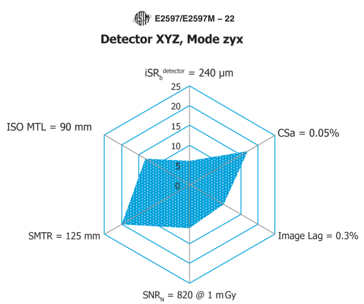
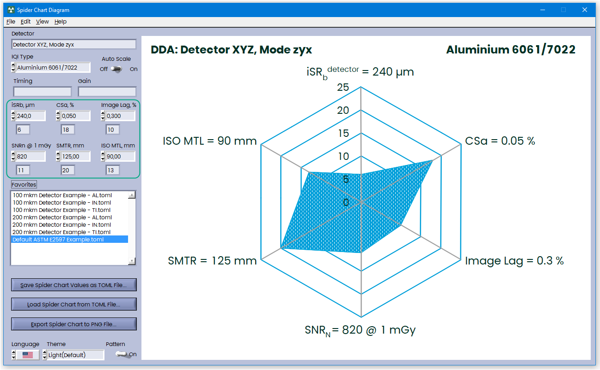
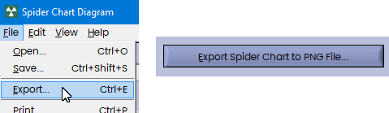
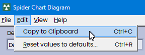
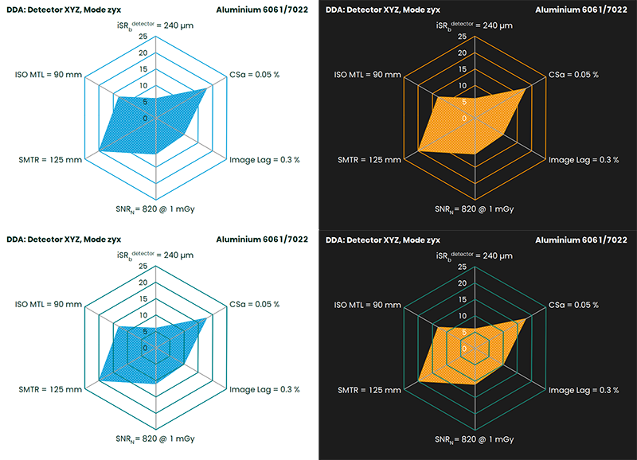
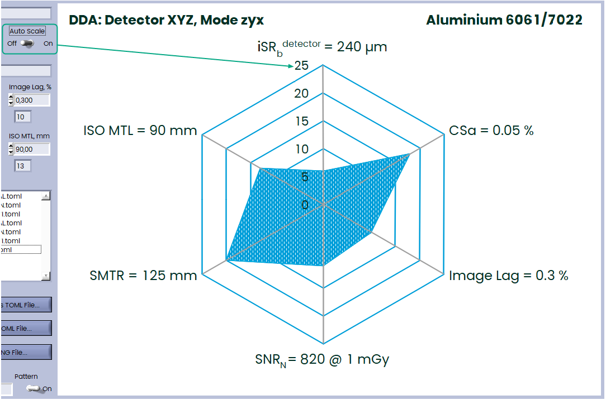
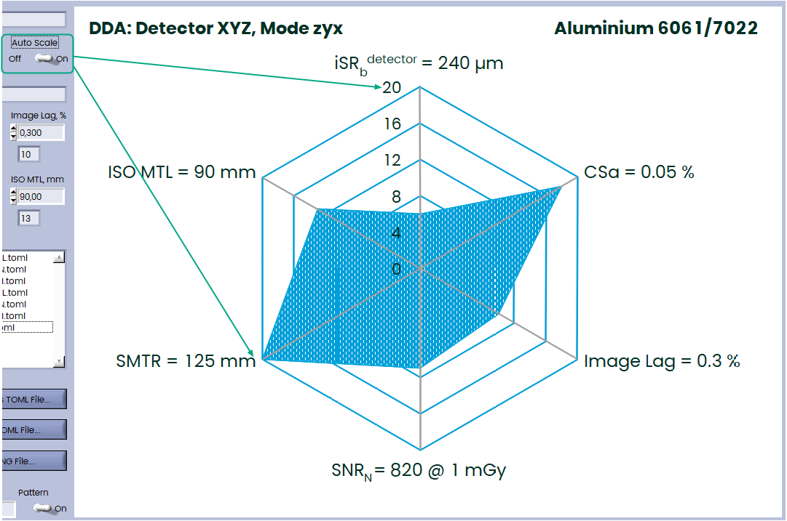
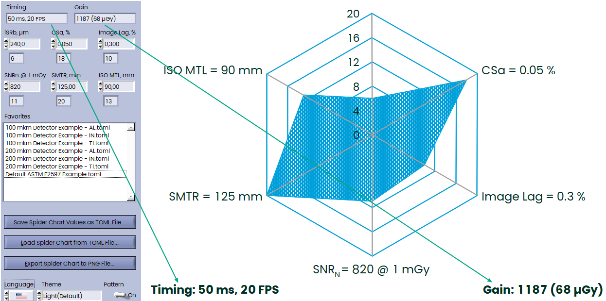

## Spider Chart Diagram

Small Tool to draw Net Summary Plot (Spider Chart Diagram) according to ASTM E2597/E2597M-22:



### User Interface

Just enter readings of six measured parameters, they will be turned into Quality Numbers and drawn as Spider Chart Diagram (don't forget to select IQI Type):



### Save and load your Diagrams

You can save your data to the TOML Files (**TOML** stands for **"Tom's Obvious, Minimal Language."** ) TOML is often used in projects written in languages like Rust. It is similar to JSON, YAML, or INI files and easy to read:

```toml
iqi = 0
detector = "Detector XYZ, Mode zyx"
isrb = 240.0
csa = 0.05
lag = 0.3
snrn = 820.0
smtr = 125.0
mtl = 90.0
timing = ""
gain = ""
```

You can save and load these files from File Menu or using these two buttons:


You can also drag \*.toml files to the Front Panel or save most used diagrams into favorites folder. If you will drag your \*.toml file on the Favorites List, then the file will be copied to the favorites folder.

### Export Diagrams

You can export Diagrams to PNG image File:



This will create PNG File 970x700 pixels.

You can also copy this image to the Clipboard directly from the software:



### Changing Appearance

You can choose Dark or Light Theme with Axis or without from View Menu:



Also you can change language, currently the only English and German are supported.

### Auto Scale

Adjust the spider chart scale to accommodate the smallest class.

Auto Scale is deactivated — Max Class is 25 (default):



When Auto Scale is enabled, then Spider Chart adjusted to accommodate the smallest class. in this case 20:



### Timing and Gain

Although it is not strictly necessary, it is recommended to note the Timing and Gain used, as DDA readings depend on these parameters:



### Quality Numbers

You can see Quality Numbers from Help Menu:


### Spider Chart Parameters

There are six important DDA Parameters:

#### iSRb Detector

Interpolated Basic Spatial Resolution — determined using a duplex wire gauge. It reflects the sharpness of the image and is measured in micrometers (µm). Lower values indicate higher resolution. Don't forget to place it directly on the detector with an angle between 2° ... 5° to the rows/columns of the DDA. Usually this test performed at 220 kV with 0.5 mm Cu Filter.

#### CSa

Achievable Contrast Sensitivity — calculated using step-wedge phantoms. Lower CSa values mean better contrast sensitivity. Expressed as a percentage.
$$
CSa = \frac{5\%}{CNR(5\%)}
$$
where
$$
CNR(5\%) = \frac{0.5 \cdot \left[\text{signal(area 1)} + \text{signal(area 3)}\right] - \text{signal(area 2)}}{\sqrt{0.5 \cdot \left[\text{noise(area 1)}^2 + \text{noise(area 3)}^2\right]}}
$$


#### Image Lag

Measured as a percentage of signal remaining in the first frame after exposure. Important for dynamic or high-speed imaging. Take a note that this is first frame normalized to 1 s:
$$
GlobalLag1s = \frac{{GlobalLag1f}}{{framerate}}
$$
where
$$
GlobalLag1f = \frac{PV_2 - PV_0}{PV_1 - PV_0} \cdot 200\%
$$


#### SNRn

Normalized Signal-to-Noise Ratio — calculated at 1 mGy dose. Higher SNRn values indicate better image quality. Normalized using the iSRb value:
$$
SNR_N = \frac{SNR \cdot 88.6 \, \mu m}{iSR_{detector}^b}
$$

#### SMTR

Specific Material Thickness Range — Defined by the SNR threshold (≥130 for basic, which is default for Spider Chart; ≥250 for enhanced). Indicates the usable thickness range for inspection.

#### ISO MTL

ISO Material Thickness Limit — Based on SNRn thresholds (≥70 for Class A, which is default for Spider Chart; ≥100 for Class B). Ensures compliance with ISO Standard.

Refer to the original ASTM E2597/E2597M-22 Standard for more details.

Enjoy!
