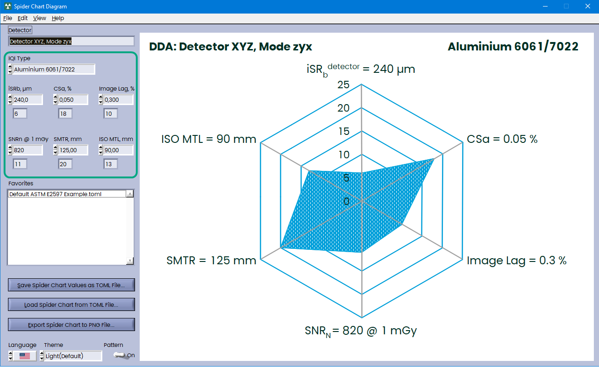
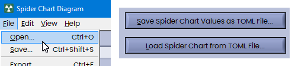
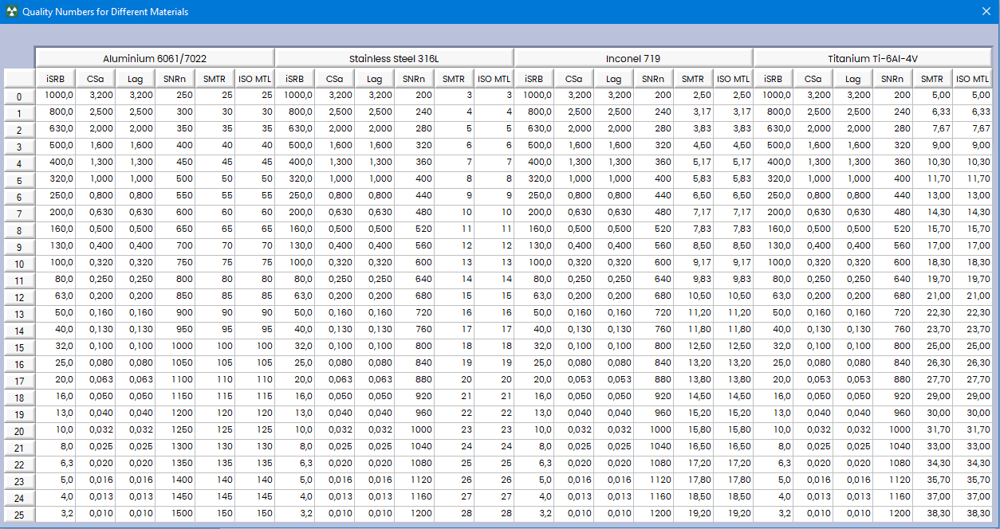

## Spider Chart Diagram

Small Tool to draw Net Summary Plot (Spider Chart Diagram) according to ASTM E2597/E2597M-22:


### User Interface

Just enter readings of six measured parameters, they will be turned into Quality Numbers and drawn as Spider Chart Diagram (don't forget to select IQI Type):



### Save and load your Diagrams

You can save your data to the TOML Files (**TOML** stands for **"Tom's Obvious, Minimal Language."** ) TOML is often used in projects written in languages like Rust. It is similar to JSON, YAML, or INI files and easy to read:

```toml
iqi = 0
detector = "Detector XYZ, Mode zyx"
isrb = 240.0
csa = 0.05
lag = 0.3
snrn = 820.0
smtr = 125.0
mtl = 90.0
```

You can save and load these files from File Menu or using these two buttons:



You can also drag \*.toml files to the Front Panel or save most used diagrams into favorites folder. If you will drag your \*.toml file on the Favorites List, then the file will be copied to the favorites folder.

### Export Diagrams

You can export Diagrams to PNG image File:


This will create PNG File 970x700 pixels.

You can also copy this image to the Clipboard directly from the software:


### Changing Appearance

You can choose Dark or Light Theme with Axis or without from View Menu:


Also you can change language, currently the only English and German are supported.

### Quality Numbers

You can see Quality Numbers from Help Menu:



Enjoy!
